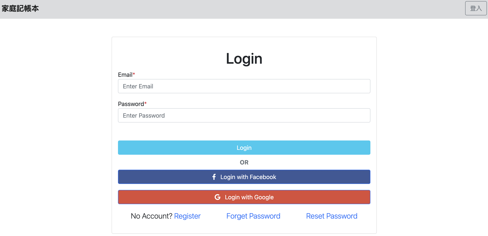

# 我的餐廳清單



## 介紹

紀錄屬於自己的記帳本，可以在此網站上擁有自己的帳號管理各項支出，並且能夠瀏覽支出、分類支出、修改支出。

### 功能

- 查看所有支出
- 新增支出
- 編輯支出
- 刪除支出
- 分類支出
- 登入與登出
- 註冊帳號
- 可用 Facebook 登入
- 可用 Google 登入
- 使用者忘記密碼可以利用驗證碼重設密碼
- 使用者可以重設密碼

## 開始使用

1. 請先確認有安裝 node.js 與 npm
2. 將專案 clone 到本地
3. 在本地開啟之後，透過終端機進入資料夾，輸入：

   ```bash
   npm install
   ```

4. 安裝完畢後，繼續輸入：

   ```bash
   npm run dev
   ```

5. 若看見此行訊息則代表順利運行，打開瀏覽器進入到以下網址

   ```bash
   Listening on http://localhost:3000
   ```

6. 建立種子資料(類別、假帳號、假支出)
   ```bash
   npm run seed
   ```
8. 測試種子資料

| Name | Email | Password |
| ------------- | :---: | -------- |
| user          | user@example.com| 12345678  |


7. 若欲暫停使用

   ```bash
   ctrl + c
   ```

## 開發工具

- node.js 14.18.0
- express 4.17.3
- express-Handlebars 3.0.0
- bootstrap 5.1
- font-awesome 5.8.1
- passport 0.5.2
- passport-local 3.0.0
- passport-facebook 3.0.0
- passport-google-oauth 2.0.0
- bcryptjs 2.4.3
- nodemailer 6.7.3

- MongoDB
- mongoose 6.0.5